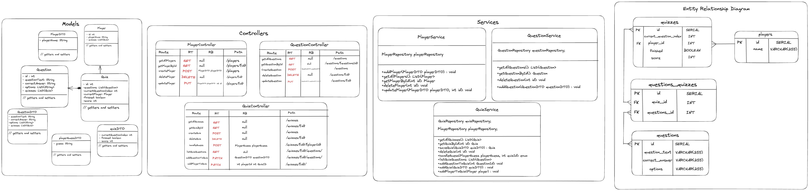
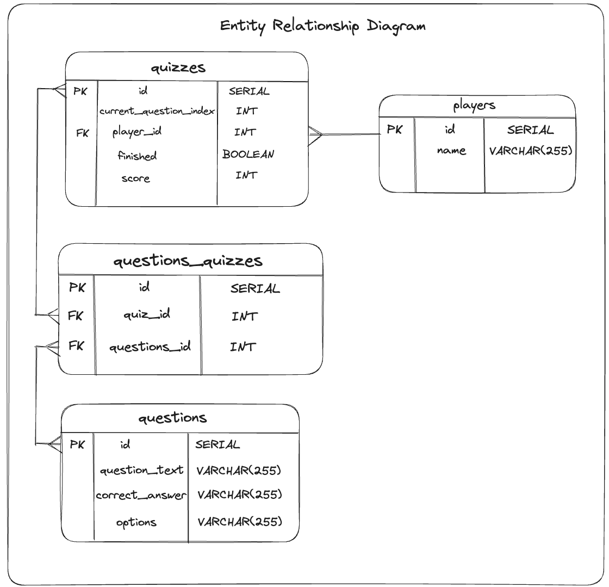

# BackEnd of the world 🌍💡 - Your knowledge Our arena

## Description

Quiz API - This project provides a comprehensive backend solution for creating and managing engaging geography quizzes. Built in Java, the API offers endpoints to handle Player and quiz management, Question addition, and Player engagement within quizzes. With a user-friendly interface, players can start quizzes, answer questions, and receive instant feedback on their performance. The API employs Java Persistence API (JPA) for efficient data management and relationships between players, quizzes, questions. By utilising DTOs (Data Transfer Objects), the API ensures smooth data exchange between layers. Dive into the world of interactive geography quizzes with our API, offering a dynamic and educational experience for players of all levels.

### Player
The Player class serves as a representation of an individual participant within the Quiz application. It is designed as an entity mapped to a database table using Java Persistence API (JPA) annotations. Each Player is associated with a unique identifier and is characterised by a name. To maintain a history of the player's quiz engagement, the class establishes a one-to-many relationship with the Quiz entity, allowing a Player to be linked to multiple quizzes. Through careful management of this relationship, the Player class efficiently captures the participation history and preferences of users in the Quiz ecosystem. With both a parameterised constructor and a default constructor available, the class provides flexibility for object instantiation and initialisation.

### Quiz
The `Quiz` class in this project represents a Quiz instance, encapsulating the essential elements of a quiz session. It is mapped to a database table using Java Persistence API (JPA) annotations. Each quiz has a unique identifier and maintains a list of associated questions. The current question index, representing the progress of the quiz, is also tracked. The quiz keeps a reference to the current Player taking the Quiz and provides options to set or update the current Player. Additionally, the class includes attributes to indicate whether the quiz has been completed and the player's score. Utilising many-to-many and many-to-one relationships with other model classes, the `Quiz` class effectively captures the dynamic state and progress of a Quiz session within the application.
 

### Question
The Question class represents a single Question within the quiz application, serving as a fundamental unit for quiz content. It is defined as an entity and is mapped to a corresponding database table using Java Persistence API (JPA) annotations. Each Question possesses a unique identifier, as well as attributes for its textual content, the correct answer, and a list of answer options. This approach simplifies management and allows for easier comparison of user-selected answers during quiz evaluation. Additionally, the class establishes a many-to-many relationship with the Quiz entity, facilitating a connection between questions and quizzes in the application. Offering both a parameterised constructor and a default constructor, the class enables the instantiation of Question objects with varying levels of information. The Question class effectively encapsulates the essential elements of a quiz Question, contributing to the overall interactive and dynamic experience of the quiz application.

 
 ### Class Diagram
 
 

### Entity Relationship Diagram

-------------

## Tech Stack

The technologies used for this project are:
- Intellij IDEA, running JDK 17
- Spring Boot
- Postman
- postico
- Excalidraw
- PostgreSQL 15

-------------

## How to use the API

### RESTful route endpoints

##### To access the endpoints of the program, use `https://localhost:{port}/{endpoint}` - the default port is 8080 but any can be used

Each model - Player, Question and Quiz - have REST controllers that provide basic CRUD functionality, specifically Index, Show, Create, Update, and Delete routes. The Player and Question models also have additional functionality, similar to the ones described below.

- INDEX
  
The QuizController class orchestrates the interaction between the front-end and the back-end services for quiz management within the application. It offers a set of endpoints to handle various operations related to quizzes, including updating, adding questions and players, as well as deleting quizzes.

- UPDATE
  
`PUT https://localhost:8080/
addQuestionToQuiz: This endpoint enables the addition of questions to a quiz. By providing the IDs of the quiz and question, the method leverages the quizService to incorporate the question into the quiz. It then responds with the updated quiz object, enriched with the newly added question.

- UPDATE
  
`PUT https://localhost:8080/
addPlayerToQuiz: With this endpoint, players can be associated with a quiz. By specifying the quiz and player IDs, the method employs the quizService to establish a connection between the player and the quiz. The updated player object is returned, indicating their involvement in the quiz.

- DELETE
  
`DELETE https://localhost:8080/
deleteQuiz: This endpoint facilitates the removal of quizzes from the system. By submitting the ID of the quiz to be deleted, the method employs the quizService to perform the deletion. It responds with the ID of the deleted quiz, confirming its successful removal.

Through these endpoints, the QuizController empowers the application's users to dynamically modify quizzes, enhance player engagement, and maintain an up-to-date collection of quizzes. By seamlessly coordinating with the underlying services, the controller contributes to a user-friendly and comprehensive quiz management experience.

### How a player can play the quiz: 

When a player starts a quiz, they are presented with the first question on the list. The quiz interface displays the question text and multiple-choice options. The player reads the question and selects their answer from the provided options. Once they've made their selection, they can proceed to the next question by clicking a "Next" button.

As the player advances through the quiz, the interface keeps track of their progress, showing the current question number and providing a visual indicator of how far they've come. The player continues answering questions, clicking "Next" after each question to move forward.

Upon reaching the last question, the "Next" button might change to a "Finish" button. Once the player clicks "Finish," the quiz is submitted, and the application calculates the player's score based on the answers they've provided. The score is displayed, indicating how many questions the player answered correctly out of the total number of questions.

If the quiz is time-limited, the interface might also display a countdown timer to keep players aware of the remaining time. When the timer reaches zero, the quiz is automatically submitted, and the player's score is calculated.

After completing the quiz, the player might have the option to review their answers, seeing which questions they answered correctly and which ones they got wrong. This review phase can help players learn from their mistakes and improve their knowledge for future quizzes.

Overall, the player's experience involves reading and answering questions, navigating through the quiz, and receiving instant feedback on their performance. The interactivity and engagement provided by the application contribute to an enjoyable and educational quiz-playing experience.

----------------

## Dependancies
- Spring Web
- SpringBoot Devtools
- Spring Data JPA
- PostgreSQL Driver

----------------

## Collaborators
- Abdulaziz Alzaid
- Hannah Adams
- Michaelson Baptist
- Nimo Mohamed
